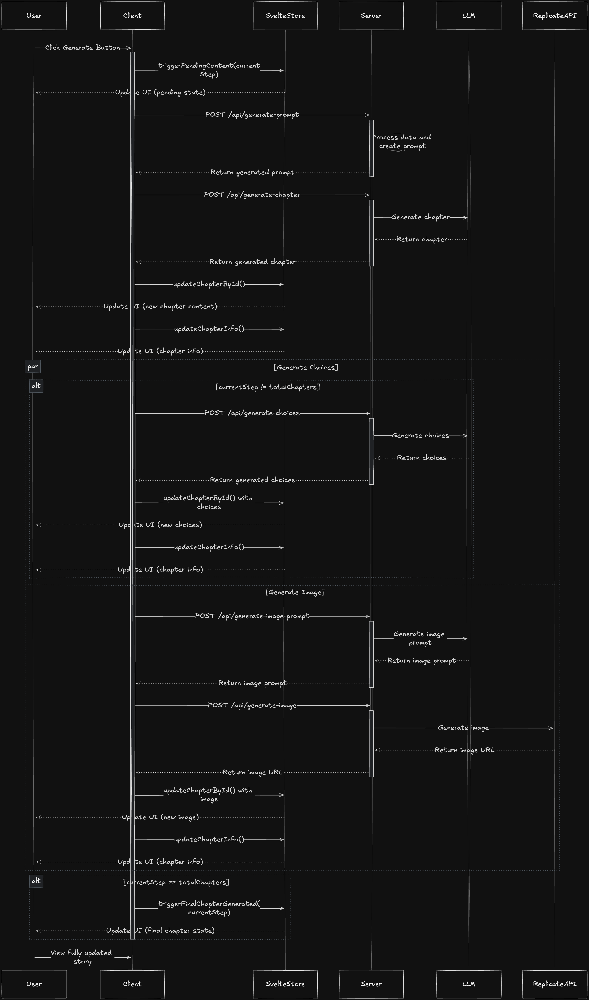

# AI Story Generator

## video
[](https://www.youtube.com/watch?v=n5QAzp02FrU)

## Project Summary

The AI Story Generator is an interactive web application that creates personalized stories for children using artificial intelligence. It allows users to choose story themes, input child details, and generates unique story chapters with accompanying images. The application uses a combination of language models for text generation and diffusion models to create a rich, interactive storytelling experience. Currently it operates mostly on the client and doesn't store any data serverside. Images persist for one hour. Story is saved in a Svelte Store and in the local storage. Based on a cool prompt I saw in a Tweet [recently](https://x.com/jelleprins/status/1824897109813788934).

## Technologies Used

- TypeScript
- Svelte
- SvelteKit
- Tailwind CSS
- shadcn-svelte
- OpenAI API
- Anthropic API
- Replicate API

## Project Structure

```
ai-story-generator/
├── src/
│   ├── lib/
│   │   ├── components/
│   │   ├── data/
│   │   ├── llm-providers/
│   │   ├── stores/
│   │   ├── types/
│   │   └── utils/
│   ├── routes/
│   │   ├── api/
│   │   │   ├── generate-chapter/
│   │   │   │   └── +server.ts
│   │   │   ├── generate-choices/
│   │   │   │   └── +server.ts
│   │   │   ├── generate-image/
│   │   │   │   ├── [id]/
│   │   │   │   │   └── +server.ts
│   │   │   │   └── +server.ts
│   │   │   ├── generate-image-prompt/
│   │   │   │   └── +server.ts
│   │   │   └── generate-prompt/
│   │   │       └── +server.ts
│   │   ├── devtest/
│   │   │   ├── image/
│   │   │   │   └── +page.svelte
│   │   │   └── +page.svelte
│   │   ├── themes/
│   │   │   ├── [slug]/
│   │   │   │   ├── reader/
│   │   │   │   │   ├── +page.server.ts
│   │   │   │   │   └── +page.svelte
│   │   │   │   ├── +page.server.ts
│   │   │   │   └── +page.svelte
│   │   │   └── +page.svelte
│   │   ├── +layout.svelte
│   │   └── +page.svelte
│   └── app.html
├── static/
├── tests/
├── .env
├── package.json
├── svelte.config.js
├── tailwind.config.js
├── tsconfig.json
└── vite.config.ts
```

## API Keys

Currently, the project uses the following external APIs:

- [OpenAI API](https://platform.openai.com/)
- [Anthropic API](https://www.anthropic.com/)
- [Replicate API](https://replicate.com/)

Note: For language model tasks, you can choose to use either OpenAI or Anthropic. I've found that performance varies depending on the specific task, so having both options available can be beneficial.

After obtaining the API keys, create a `.env` file in the root directory of the project and add your API keys.

## Getting Started

To run the AI Story Generator locally, follow these steps:

1. Clone the repository:

   ```
   git clone https://github.com/jwa91/ai-story-generator-svelte
   cd ai-story-generator
   ```

2. Install dependencies:

   ```
   pnpm install
   ```

3. Set up your `.env` file with the required API keys as described in the previous section.

4. Start the development server:

   ```
   pnpm run dev
   ```

5. Open your browser and navigate to `http://localhost:5073` (or the port specified in the console output).

## Generate Chapter Function Flow

The generate chapter function is probably the most complex function of the project, it involves multiple components and API calls. Here's a breakdown of the process:


_[Check excalidraw](https://link.excalidraw.com/readonly/L1Ih2IWGkyTAdx28vbsg)_

This diagram illustrates the interactions between the user, client-side application, server, and various APIs involved in generating a single chapter of the story.

## Next Steps

To further improve and expand the AI Story Generator project, consider the following next steps:

1. Improve code structure to better handle quick change of models and remove much of the duplications and unused stuff
2. Improve UI
3. Improve user/model interaction:
   -more customization options
   -feedback system
   -improve interactivity
4. Add new features:
   -More interactive elements (challenges, open questions, riddle)
   -Languagepicker
   -"Explain mode" (to learn new things)
5. Optimize token usage
